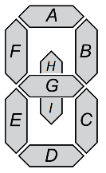
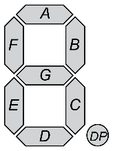
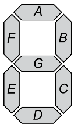
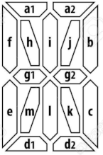
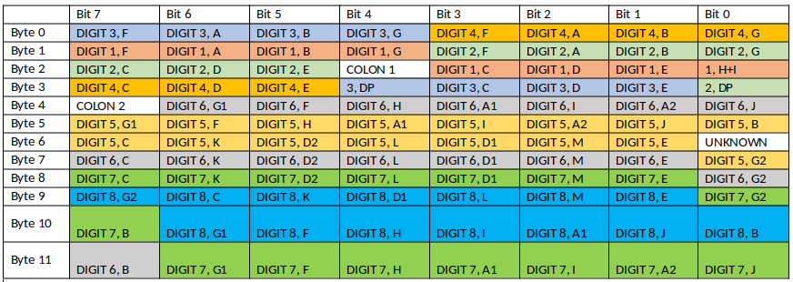

# 80s BMW On-Board Computer Display Protocol

## Display Layout

| Digit 1 | Digit 2 | Colon 1 | Digit 3 | Digit 4 | Digit 5 | Digit 6 | Colon 2 | Digit 7 | Digit 8 |
|---------|---------|---------|---------|---------|---------|---------|---------|---------|---------|
|  |  |  |  |  |  |  |  |  |  |

Digits 1, 2, 3, and 4 are 7-segment displays; 5, 6, and 7 are 16-segment displays; digit 8 is a 16-segment display with the top and bottom segments joined to work as a 14-segment display. 

Digit 1 has an additional two segments which are similar to a half height J and M segments in the 14-segment displays. Digits 2 and 3 have trailing decimal ponits. Colons are located between the 2nd and 3rd digits and also between the 6th and 7th digits. 

## Display Protocol Table

|         | Bit 7      | Bit 6      | Bit 5      | Bit 4      | Bit 3      | Bit 2      | Bit 1      | Bit 0      |
|---------|------------|------------|------------|------------|------------|------------|------------|------------|
| Byte 0  | DIGIT 3,F  | DIGIT 3,A  | DIGIT 3,B  | DIGIT 3,G  | DIGIT 4,F  | DIGIT 4,A  | DIGIT 4,B  | DIGIT 4,G  |
| Byte 1  | DIGIT 1,F  | DIGIT 1,A  | DIGIT 1,B  | DIGIT 1,G  | DIGIT 2,F  | DIGIT 2,A  | DIGIT 2,B  | DIGIT 2,G  |
| Byte 2  | DIGIT 2,C  | DIGIT 2,D  | DIGIT 2,E  | COLON 1    | DIGIT 1,C  | DIGIT 1,D  | DIGIT 1,E  | 1, H+I     |
| Byte 3  | DIGIT 4,C  | DIGIT 4,D  | DIGIT 4,E  | 3, DP      | DIGIT 3,C  | DIGIT 3,D  | DIGIT 3,E  | 2, DP      |
| Byte 4  | COLON 2    | DIGIT 6,G1 | DIGIT 6,F  | DIGIT 6,H  | DIGIT 6,A1 | DIGIT 6,I  | DIGIT 6,A2 | DIGIT 6,J  |
| Byte 5  | DIGIT 5,G1 | DIGIT 5,F  | DIGIT 5,H  | DIGIT 5,A1 | DIGIT 5,I  | DIGIT 5,A2 | DIGIT 5,J  | DIGIT 5,B  |
| Byte 6  | DIGIT 5,C  | DIGIT 5,K  | DIGIT 5,D2 | DIGIT 5,L  | DIGIT 5,D1 | DIGIT 5,M  | DIGIT 5,E  | UNKNOWN    |
| Byte 7  | DIGIT 6,C  | DIGIT 6,K  | DIGIT 6,D2 | DIGIT 6,L  | DIGIT 6,D1 | DIGIT 6,M  | DIGIT 6,E  | DIGIT 5,G2 |
| Byte 8  | DIGIT 7,C  | DIGIT 7,K  | DIGIT 7,D2 | DIGIT 7,L  | DIGIT 7,D1 | DIGIT 7,M  | DIGIT 7,E  | DIGIT 6,G2 |
| Byte 9  | DIGIT 8,G2 | DIGIT 8,C  | DIGIT 8,K  | DIGIT 8,D1 | DIGIT 8,L  | DIGIT 8,M  | DIGIT 8,E  | DIGIT 7,G2 |
| Byte 10 | DIGIT 7,B  | DIGIT 8,G1 | DIGIT 8,F  | DIGIT 8,H  | DIGIT 8,I  | DIGIT 8,A1 | DIGIT 8,J  | DIGIT 8,B  |
| Byte 11 | DIGIT 6,B  | DIGIT 7,G1 | DIGIT 7,F  | DIGIT 7,H  | DIGIT 7,A1 | DIGIT 7,I  | DIGIT 7,A2 | DIGIT 7,J  |

## Display Protocol Table (Colored)

## Format of the digits arrary

* 16 Segment: DP-G1-M-L-K-G2-J-I-H-F-E-D1-D2-C-B-A2-A1
* 14 Segment: DP-N-M-L-K-J-H-G2-G1-F-E-D-C-B-A // TODO: Test the 14 seg and make sure I know what is joined.
* 7 Segment: DP-G-F-E-D-C-B-A

# Credits
 - ASCII font layout taken from dmadison's repo @ https://github.com/dmadison/LED-Segment-ASCII